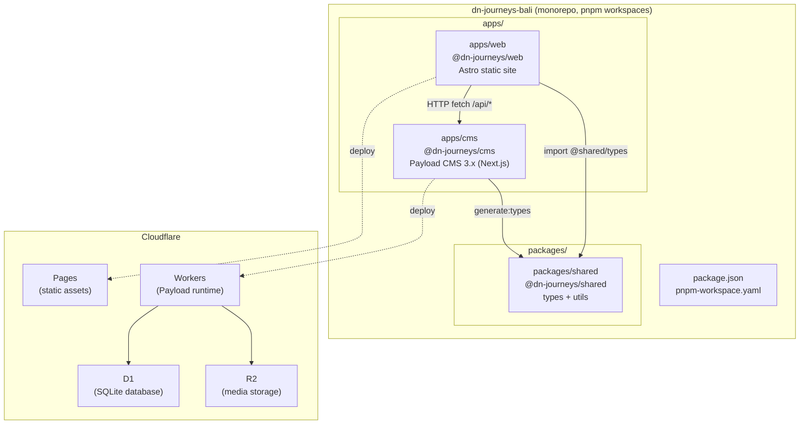
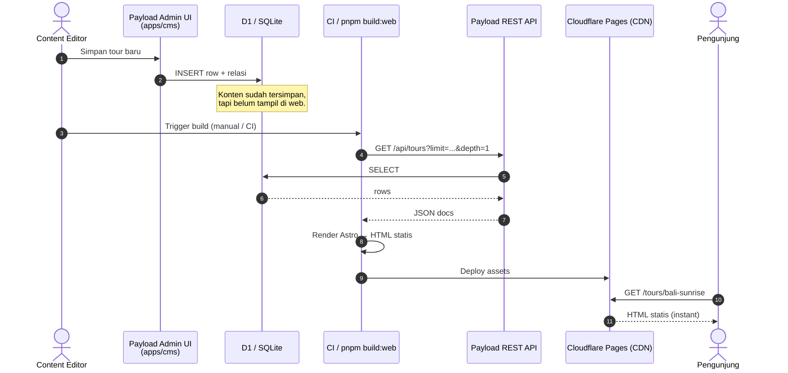
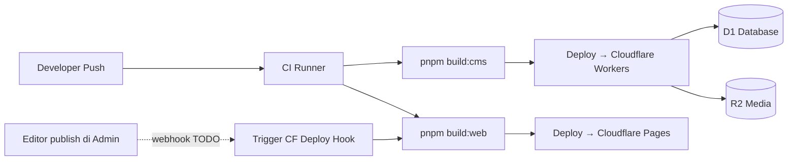

# 01 — ARCHITECTURE

> Dokumentasi arsitektur teknis proyek **DnJourneysBali** — website travel agency berbasis monorepo (Astro + Payload CMS) yang di-hosting sepenuhnya di Cloudflare.

Dokumen ini ditujukan untuk **developer** (yang perlu tahu di mana mengubah kode) dan juga **stakeholder / content manager non-teknis** (yang perlu paham kenapa perubahan CMS tidak selalu langsung tampil di website).

---

## 1. Overview Monorepo

Proyek ini menggunakan pola **monorepo** — satu repository Git berisi beberapa "aplikasi" dan "package" yang berbagi kode. Manajemen paket menggunakan **pnpm workspaces** (lihat `pnpm-workspace.yaml`).

Ada tiga bagian utama:

| Path | Nama Paket | Peran |
| --- | --- | --- |
| `apps/web` | `@dn-journeys/web` | **Front-End publik** — website yang dilihat pengunjung. Dibangun dengan **Astro** (static output) + Tailwind CSS. |
| `apps/cms` | `@dn-journeys/cms` | **Back-End & Headless CMS** — panel admin untuk mengelola konten. Dibangun dengan **Payload CMS 3.x** di atas Next.js. |
| `packages/shared` | `@dn-journeys/shared` | **Kode bersama** — type TypeScript (auto-generated dari Payload) dan utilitas kecil (mis. `format-price`) yang dipakai baik oleh `web` maupun `cms`. |

### Kenapa monorepo?

- **Satu sumber kebenaran** untuk tipe data. Payload meng-generate `payload-types.ts` langsung ke `packages/shared/src/types/`, sehingga front-end mendapat tipe kolom yang persis sama dengan skema CMS — tidak ada drift antara "apa yang di-input di admin" dan "apa yang di-render di halaman".
- **Deployment terpisah tapi kode tersinkron**: `apps/web` dan `apps/cms` dideploy ke Cloudflare secara independen, tapi tetap berbagi kontrak data melalui `packages/shared`.
- **Skrip terpusat** — lihat `package.json` root:
  - `pnpm dev:web` / `pnpm dev:cms` untuk development
  - `pnpm build:web` / `pnpm build:cms` untuk build produksi
  - `pnpm generate:types` untuk regenerasi tipe dari skema CMS

### Diagram struktur monorepo



---

## 2. Peta Alur Data & Strategi Rendering (Astro ↔ Payload)

Front-end (`apps/web`) tidak pernah "menyentuh" database secara langsung. Semua data konten diambil melalui **REST API Payload** (`/api/<collection>` dan `/api/globals/<slug>`). Layer kliennya ada di [apps/web/src/lib/payload.ts](apps/web/src/lib/payload.ts) — semua halaman Astro memanggil helper seperti `getTours()`, `getPageBySlug()`, `getSiteSettings()`.

Konfigurasi Astro saat ini (`apps/web/astro.config.mjs`) menggunakan `output: 'static'`, artinya **secara default seluruh site di-generate saat build (SSG)**. Tiga metode rendering di bawah menjelaskan pilihan yang tersedia dan trade-off-nya.

### a. SSG — Static Site Generation *(mode aktif saat ini)*

- Data di-fetch **sekali saat `pnpm build:web` dijalankan**.
- Astro merender setiap halaman menjadi HTML statis lalu di-upload ke **Cloudflare Pages**.
- ✅ **Sangat cepat** — tidak ada compute per request, cukup serve file dari CDN edge Cloudflare.
- ✅ **Murah** — sesuai target budget ~$5/bulan.
- ⚠️ **Perubahan konten di Payload tidak langsung tampil**. Halaman baru muncul hanya setelah rebuild + redeploy `apps/web`.

### b. SSR — Server-Side Rendering

- Data di-fetch **setiap HTTP request** dari pengunjung. Halaman dirender on-the-fly di Cloudflare Workers.
- ✅ Data **selalu real-time** — perubahan di CMS langsung terlihat.
- ⚠️ Setiap request memanggil API Payload → lebih lambat & lebih banyak konsumsi Workers request quota.
- ⚠️ Jika CMS down, halaman ikut down.

<!-- TODO: belum diimplementasi — untuk mengaktifkan SSR pada rute tertentu, ubah `output: 'static'` menjadi `output: 'hybrid'` di astro.config.mjs dan tambahkan `export const prerender = false` pada halaman yang ingin SSR. -->

### c. ISR / On-Demand Revalidation

- Halaman tetap statis, tapi bisa **di-rebuild ulang secara selektif** ketika konten berubah — biasanya lewat **webhook** dari Payload → Cloudflare Pages Deploy Hook.
- ✅ Cepat seperti SSG, tapi update tidak menunggu manual rebuild.
- ⚠️ Perlu setup webhook & mapping mana perubahan collection mana yang men-trigger rebuild path apa.

<!-- TODO: belum diimplementasi — belum ada afterChange hook di collections yang memanggil Cloudflare Deploy Hook. Tempat implementasi: apps/cms/src/collections/*.ts (hooks.afterChange) + variabel env CF_DEPLOY_HOOK_URL. -->

### Sequence diagram: konten dibuat di CMS → tampil di browser (mode SSG)



---

## 3. Spotlight untuk Non-Teknis: Kenapa Perubahan CMS Tidak Langsung Tampil?

Bagian ini untuk tim content / marketing yang bertanya *"Aku sudah update di admin, kok di website belum berubah?"*

### Analogi: Cetakan Statis vs Restoran Pesan-Langsung

- **SSG (mode kita sekarang) = Percetakan brosur.** Kita mencetak 10.000 brosur di pagi hari. Kalau siangnya harga berubah, brosur yang sudah tercetak tetap menampilkan harga lama — sampai kita **cetak ulang**. Kelebihannya: brosur bisa dibagikan cepat & massal tanpa biaya per lembar.
- **SSR = Restoran pesan-langsung.** Setiap tamu datang, koki masak dari nol berdasarkan bahan hari itu. Selalu segar, tapi setiap pesanan butuh waktu & tenaga koki.

Website ini memakai model **percetakan brosur** karena kita ingin cepat + murah. Konsekuensinya: perubahan di CMS **butuh rebuild** dulu.

### Kalau konten baru belum muncul di website, cek urutan ini:

1. **Sudah klik "Publish" (bukan "Save Draft") di Payload?** Helper `fetchCollection` default meng-filter `status=published` — draft tidak akan pernah muncul.
2. **Sudah dijalankan rebuild `apps/web`?** Bisa lewat perintah `pnpm build:web` lokal, atau tunggu deploy otomatis dari CI (jika sudah dikonfigurasi).
3. **Cache CDN Cloudflare sudah purge?** Kadang browser / edge masih menyimpan versi lama. Coba hard reload (Ctrl+Shift+R) atau purge cache Pages.
4. **URL slug-nya benar?** Slug di CMS harus persis sama dengan URL. Slug auto-generated oleh hook di `apps/cms/src/hooks/generateSlug.ts`.

Kalau keempatnya sudah OK dan konten masih tidak muncul, itu bug — hubungi developer.

---

## 4. Modul, Struktur Folder & Lokasi Perubahan (Development Guide)

### 4.1 Peta folder `apps/web` (Astro front-end)

```
apps/web/src/
├── assets/            # Gambar/aset static di-bundle Astro
├── components/
│   ├── blocks/        # Block renderer utk konten CMS (Hero, CTA, Gallery, dst.)
│   ├── cards/         # Kartu ringkas (TourCard, VillaCard, dsb.)
│   ├── common/        # Elemen umum (Button, Section, dsb.)
│   └── navigation/    # Header, Footer, Menu
├── config/            # Konstanta site & feature-flag modul
├── layouts/           # BaseLayout.astro, PageLayout.astro
├── lib/
│   ├── payload.ts     # ★ Client fetch ke Payload REST API
│   ├── lexical.ts     # Renderer rich-text Lexical → HTML
│   ├── blockStyles.ts # Style mapping utk BlockRenderer
│   ├── whatsapp.ts    # Builder link WhatsApp (booking)
│   └── animations.ts
├── pages/             # ★ File-based routing Astro (setiap .astro = 1 URL)
└── styles/
```

Block renderer utama: [apps/web/src/components/blocks/BlockRenderer.astro](apps/web/src/components/blocks/BlockRenderer.astro) — memetakan `blockType` dari Payload ke komponen Astro yang sesuai.

### 4.2 Peta folder `apps/cms` (Payload)

```
apps/cms/src/
├── payload.config.ts  # ★ Konfigurasi utama Payload (collections, editor, DB, CORS)
├── collections/       # ★ Definisi tiap koleksi (Tours, Accommodations, dst.)
├── globals/           # Singleton config (SiteSettings, Header, Footer)
├── blocks/            # Definisi blok layout page-builder
├── fields/            # Field reusable
├── access/            # Aturan akses (RBAC) — lihat 04-RBAC.md
├── hooks/             # Lifecycle hooks (generateSlug, dst.)
├── app/               # Next.js app router (admin UI mount point)
└── scripts/           # Skrip maintenance (seed, migrate, dsb.)
```

**8 modul layanan** (dapat di-enable/disable per klien) diwakili oleh koleksi berikut:

| Modul | File Collection |
| --- | --- |
| Tours | `collections/Tours.ts` |
| Villa / Hotel (Accommodations) | `collections/Accommodations.ts` |
| Water Activities | `collections/WaterActivities.ts` |
| Yacht | `collections/Yachts.ts` |
| Restaurant | `collections/Restaurants.ts` |
| Wedding / Event (Venues) | `collections/Venues.ts` |
| Rental | `collections/Rentals.ts` |
| Destinations (support) | `collections/Destinations.ts` |

Toggle per-modul saat ini di-drive dari `apps/web/src/config/` <!-- TODO: verifikasi mekanisme feature-flag final (belum ada schema `enabledModules` di global SiteSettings). -->

### 4.3 Panduan "Di mana saya harus mengubah kode jika…"

| Kalau kamu ingin... | Ubah di... |
| --- | --- |
| Mengubah **tampilan** kartu tour di halaman list | `apps/web/src/components/cards/` (mis. `TourCard.astro`) |
| Menambah/mengubah **section** di halaman detail | `apps/web/src/components/blocks/` + `pages/tour/` |
| Menambah **halaman URL baru** yang statis | Buat file `.astro` baru di `apps/web/src/pages/` |
| Menambah **field** baru pada koleksi Tours | `apps/cms/src/collections/Tours.ts` → lalu jalankan `pnpm generate:types` |
| Menambah **koleksi baru** | Buat file di `apps/cms/src/collections/`, register di `payload.config.ts` (`collections: [...]`) |
| Mengubah **menu navigasi** default | `apps/cms/src/globals/HeaderSettings.ts` (schema) + `apps/web/src/components/navigation/` (tampilan) |
| Mengubah **tipe TypeScript bersama** (utility) | `packages/shared/src/utils/` atau `packages/shared/src/types/` (jangan edit `payload-types.ts` — auto-generated) |
| Menambah **utility helper** yang dipakai web & cms | `packages/shared/src/utils/` + export di `packages/shared/src/index.ts` |
| Mengubah **cara link WhatsApp** dibuat | `apps/web/src/lib/whatsapp.ts` |
| Mengubah **cara rich-text** dirender | `apps/web/src/lib/lexical.ts` (mapping node → HTML) |

> ⚠️ Setiap perubahan schema di `apps/cms/src/collections/*` atau `globals/*` **wajib** diikuti `pnpm generate:types` supaya `packages/shared/src/types/payload-types.ts` terupdate dan front-end tetap type-safe.

---

## 5. Environment Variables & Integrasi Pipeline

### 5.1 Variabel kunci

| Variabel | Digunakan di | Public / Secret | Fungsi |
| --- | --- | --- | --- |
| `CMS_URL` | `apps/web` | Public (build-time) | Base URL Payload API yang di-fetch oleh Astro. Default `http://localhost:3030`. Lihat [apps/web/src/lib/payload.ts:16](apps/web/src/lib/payload.ts#L16). |
| `SITE_URL` | `apps/cms` | Public | Origin front-end untuk CORS Payload. Lihat [apps/cms/src/payload.config.ts:91](apps/cms/src/payload.config.ts#L91). |
| `SERVER_URL` | `apps/cms` | Public | URL publik CMS (dipakai Payload untuk generate absolute URL / email link). |
| `DATABASE_URI` | `apps/cms` | Secret | Connection string database. Lokal: `file:./cms.db`. Produksi (D1): connection binding via Cloudflare. |
| `PAYLOAD_SECRET` | `apps/cms` | **Secret** | Kunci enkripsi JWT/session Payload. **Wajib** di-set di produksi. |
| `CF_DEPLOY_HOOK_URL` | `apps/cms` | Secret | <!-- TODO: belum diimplementasi --> URL webhook Cloudflare Pages untuk trigger rebuild `apps/web` setelah konten berubah. |
| `R2_*` (access key, bucket, endpoint) | `apps/cms` | Secret | Kredensial R2 untuk upload media. <!-- TODO: verifikasi nama var final saat adapter R2 dipasang. --> |

### 5.2 Contoh `apps/web/.env.example`

```bash
# URL Payload CMS API yang di-fetch saat build (SSG)
# Lokal: http://localhost:3030
# Produksi: https://cms.dnjourneysbali.com
CMS_URL=http://localhost:3030
```

### 5.3 Contoh `apps/cms/.env.example`

```bash
# Wajib — kunci enkripsi Payload (generate random 32+ char)
PAYLOAD_SECRET=change-this-to-a-long-random-string

# URL publik CMS (untuk absolute link)
SERVER_URL=http://localhost:3030

# Origin front-end (untuk CORS)
SITE_URL=http://localhost:4321

# Database — lokal: SQLite file, produksi: D1 binding
DATABASE_URI=file:./cms.db

# (Opsional, produksi) Webhook Cloudflare Pages untuk rebuild otomatis
# CF_DEPLOY_HOOK_URL=https://api.cloudflare.com/client/v4/pages/webhooks/deploy_hooks/xxxx
```

### 5.4 Alur integrasi pipeline (rangkuman)



---

## Referensi silang

- Schema tiap koleksi & field-nya → **02-DATABASE-SCHEMA.md**
- Model konten & block builder → **03-CONTENT-MODEL.md**
- Access control (siapa boleh apa di CMS) → **04-RBAC.md**
- Infrastruktur Cloudflare & deployment → **05-INFRA.md**
- Runbook operasional → **06-MAINTENANCE-RUNBOOK.md**
- Log keputusan arsitektur → **07-DECISION-LOG.md**
- Overview bisnis → **08-PROJECT-OVERVIEW.md**
