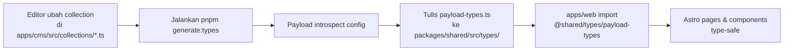

# 02 — DATABASE SCHEMA

> Skema database proyek **DnJourneysBali**, di-generate dari definisi Payload CMS 3.x pada `apps/cms/src/collections/` dan `apps/cms/src/globals/`.
>
> Database: **Cloudflare D1** (SQLite-compatible) di produksi, SQLite file lokal (`apps/cms/cms.db`) saat development. Adapter: `@payloadcms/db-sqlite` (Drizzle ORM) — lihat [payload.config.ts](apps/cms/src/payload.config.ts).

---

## 1. Entity Relationship Diagram (ERD)

Ada **13 koleksi** (jadi 13 tabel) + **3 globals** (masing-masing tabel singleton). Semua kolom relasi (`relationship` / `upload`) di Payload direpresentasikan sebagai foreign key ID di tingkat DB.

```mermaid
erDiagram
    USERS ||--o{ USERS : "createdBy (auth session)"
    MEDIA ||--o{ TOURS : "featuredImage / gallery"
    MEDIA ||--o{ ACCOMMODATIONS : "featuredImage / gallery"
    MEDIA ||--o{ WATER_ACTIVITIES : "featuredImage / gallery"
    MEDIA ||--o{ YACHTS : "featuredImage / gallery"
    MEDIA ||--o{ RESTAURANTS : "featuredImage / gallery"
    MEDIA ||--o{ VENUES : "featuredImage / gallery"
    MEDIA ||--o{ RENTALS : "featuredImage / gallery"
    MEDIA ||--o{ DESTINATIONS : "featuredImage / gallery"
    MEDIA ||--o{ CATEGORIES : "icon / featuredImage"
    MEDIA ||--o{ PAGES : "SEO ogImage / blocks"
    MEDIA ||--o{ SITE_SETTINGS : "logo / favicon / ogImage"

    DESTINATIONS ||--o{ TOURS : "destination FK"
    DESTINATIONS ||--o{ ACCOMMODATIONS : "destination FK"
    DESTINATIONS ||--o{ WATER_ACTIVITIES : "destination FK"
    DESTINATIONS ||--o{ YACHTS : "destination FK"
    DESTINATIONS ||--o{ RESTAURANTS : "destination FK"
    DESTINATIONS ||--o{ VENUES : "destination FK"
    DESTINATIONS ||--o{ RENTALS : "destination FK"

    CATEGORIES ||--o{ TOURS : "category FK (filter: module=tours)"
    CATEGORIES ||--o{ ACCOMMODATIONS : "category FK"
    CATEGORIES ||--o{ WATER_ACTIVITIES : "category FK"
    CATEGORIES ||--o{ CATEGORIES : "parent (self-relation)"

    PAGES ||--o{ PAGES : "parent (self-relation)"
    MENUS ||--o{ HEADER_SETTINGS : "primaryMenu"
    MENUS ||--o{ FOOTER_SETTINGS : "columns.menu / servicesMenu"
    PAGES ||--o{ MENUS : "items.page (when type=page)"

    USERS {
        int id PK
        string email UK "auth"
        string password "hashed"
        string name
        string role "editor|admin|super-admin"
        datetime createdAt
        datetime updatedAt
    }

    MEDIA {
        int id PK
        string filename
        string mimeType
        int filesize
        int width
        int height
        string alt
        string caption
        string credit
        json sizes "thumbnail/card/hero"
    }

    TOURS {
        int id PK
        string slug UK
        string status "draft|published"
        int sortOrder
        bool isFeatured
        string title
        string subtitle
        int destination_id FK
        int category_id FK
        string duration
        int minParticipants
        int maxParticipants
        json description "richText"
        int featuredImage_id FK
        json gallery
        string videoUrl
        json quickSpecs
        json highlights
        json meetingPoint
        json pickupService
        json itinerary
        json includes
        json excludes
        json additionalInfo "richText"
        json pricing
        json additionalBlocks
        string whatsappMessage
        json seo
    }

    ACCOMMODATIONS {
        int id PK
        string slug UK
        string status
        string name
        string subtitle
        string type "villa|hotel|resort|guesthouse"
        int starRating
        int destination_id FK
        int category_id FK
        json description "richText"
        int featuredImage_id FK
        json gallery
        json quickSpecs
        json highlightTags
        json amenities
        string checkInTime
        string checkOutTime
        json roomTypes
        string locationType
        json location
        json nearbyLandmarks
        json curatedExperiences
        json policies "richText"
        json additionalBlocks
        string whatsappMessage
        json seo
    }

    WATER_ACTIVITIES {
        int id PK
        string slug UK
        string status
        string title
        string activityType
        string difficultyLevel
        int destination_id FK
        int category_id FK
        string duration
        json description "richText"
        int featuredImage_id FK
        json gallery
        json quickSpecs
        json whatToBring
        string requirements
        json safetyInfo
        json pricing
        json additionalBlocks
        string whatsappMessage
        json seo
    }

    YACHTS {
        int id PK
        string slug UK
        string status
        string name
        string yachtType
        int capacity
        int destination_id FK
        json description
        int featuredImage_id FK
        json gallery
        json quickSpecs
        json amenities
        json specifications
        json packages
        json additionalBlocks
        string whatsappMessage
        json seo
    }

    RESTAURANTS {
        int id PK
        string slug UK
        string status
        string name
        string priceRange
        string locationType
        int destination_id FK
        json cuisineType "select hasMany"
        json description
        int featuredImage_id FK
        json gallery
        json quickSpecs
        json features
        json menuHighlights
        json location
        json openingHours
        json additionalBlocks
        string whatsappMessage
        json seo
    }

    VENUES {
        int id PK
        string slug UK
        string status
        string name
        string venueType
        int destination_id FK
        json eventTypes
        json description
        json capacity
        int featuredImage_id FK
        json gallery
        json quickSpecs
        json features
        json packages
        json location
        json testimonials
        json additionalBlocks
        string whatsappMessage
        json seo
    }

    RENTALS {
        int id PK
        string slug UK
        string status
        string title
        string rentalType
        int destination_id FK
        json description
        int featuredImage_id FK
        json gallery
        json quickSpecs
        json specifications
        json features
        json includes
        string requirements
        json pricingTiers
        json additionalBlocks
        string whatsappMessage
        json seo
    }

    DESTINATIONS {
        int id PK
        string slug UK
        string name
        string type "island|mainland"
        json description
        int featuredImage_id FK
        json gallery
        json location
        json seo
        string status
        int sortOrder
    }

    CATEGORIES {
        int id PK
        string slug UK
        string name
        string module "service module target"
        int parent_id FK
        string description
        int icon_id FK
        int featuredImage_id FK
        string status
        int sortOrder
    }

    PAGES {
        int id PK
        string slug UK
        string title
        string template
        json content "blocks"
        int parent_id FK
        json seo
        string status
        int sortOrder
    }

    MENUS {
        int id PK
        string slug UK
        string name
        json items "nested array"
        string status "active|inactive"
    }

    SITE_SETTINGS {
        int id PK
        string siteName
        string tagline
        int logo_id FK
        int logoDark_id FK
        int favicon_id FK
        json contact
        json socialMedia
        json defaultSeo
        json whatsappDefaults
        json footer
    }

    HEADER_SETTINGS {
        int id PK
        int primaryMenu_id FK
        bool stickyOnScroll
        bool transparentOnTop
        bool showCtaButton
        string ctaText
        string ctaType
        string ctaCustomLink
    }

    FOOTER_SETTINGS {
        int id PK
        bool showBrandColumn
        string brandTaglineOverride
        json columns
        bool showServicesColumn
        string servicesColumnLabel
        int servicesMenu_id FK
        bool showContactColumn
        string contactColumnLabel
        string bottomBarRightText
        bool showNewsletter
    }
```



**Catatan representasi DB (Drizzle/SQLite):**

- Field bertipe `array`, `blocks`, `group`, `richText`, `select hasMany`, dan nested `array` di Payload → di SQLite biasanya jadi **tabel relasi terpisah** (mis. `tours_gallery`, `tours_blocks_hero`, `tours_locales`). Untuk keringkasan diagram di atas, semua ditandai `json` — implementasi Drizzle bisa lihat migrasi Payload otomatis.
- Field `_status` internal Payload untuk draft/publish workflow. Proyek ini juga punya field `status` custom (`draft|published`) — dua-duanya hidup, tapi filter query dari `apps/web/src/lib/payload.ts` pakai yang `status`.

---

## 2. Data Dictionary — Detail per Tabel

Legenda:

- **PL type** = tipe field di Payload (lihat definisi kode).
- **Req** = required. **Uniq** = unique index.
- Payload otomatis menambahkan `id` (auto-increment), `createdAt`, `updatedAt` di semua koleksi.

### 2.1 System

#### `users` — [Users.ts](apps/cms/src/collections/Users.ts)

| Field | PL type | Req | Uniq | Deskripsi |
|---|---|---|---|---|
| `id` | auto | ✓ | ✓ | Primary key |
| `email` | auth | ✓ | ✓ | Otomatis dari `auth: true` |
| `password` | auth | ✓ | — | Hashed (scrypt) |
| `name` | text | ✓ | — | Nama tampilan |
| `role` | select | ✓ | — | `editor` \| `admin` \| `super-admin`. Default `editor`. Hanya super-admin bisa update field ini. |
| `createdAt` / `updatedAt` | auto | ✓ | — | ISO datetime |

Access: read = authenticated; create/delete = super-admin only; update = self or super-admin.

#### `media` — [Media.ts](apps/cms/src/collections/Media.ts)

Payload upload collection (menyimpan file di R2 di produksi, `apps/cms/media/` lokal).

| Field | PL type | Req | Uniq | Deskripsi |
|---|---|---|---|---|
| `id` | auto | ✓ | ✓ | PK |
| `filename` | upload | ✓ | ✓ | Auto |
| `mimeType` | upload | ✓ | — | Whitelist: jpeg/png/webp/svg/mp4 |
| `filesize`, `width`, `height` | upload | — | — | Auto |
| `sizes.thumbnail` (400×300), `sizes.card` (800×600), `sizes.hero` (1920×1080) | image sizes | — | — | Auto-generated oleh `sharp` |
| `alt` | text | ✓ | — | Alt text untuk a11y & SEO |
| `caption` | text | — | — | |
| `credit` | text | — | — | Photo credit |

Access: read publik, delete = admin+.

### 2.2 Content

#### `destinations` — [Destinations.ts](apps/cms/src/collections/Destinations.ts)

| Field | PL type | Req | Uniq | Deskripsi |
|---|---|---|---|---|
| `name` | text | ✓ | — | |
| `slug` | text | ✓ | ✓ | Auto-generated oleh hook `generateSlug` |
| `type` | relationship → destination-types | ✓ | — | **Phase 3.23**: dulu select `island`/`mainland`, kini FK ke `destination-types`. |
| `parent` | relationship → destinations | — | — | **Phase 3.22**: self-relation, sub-lokasi (Kuta → Main Island) |
| `showInFilter` | checkbox | — | — | **Phase 3.22**: core flag (Super Admin field access) |
| `description` | richText | — | — | Lexical JSON |
| `featuredImage` | upload → media | — | — | FK |
| `gallery[]` | array | — | — | `{ image: media }` |
| `location` | group | — | — | address / mapEmbed / lat / lng (dari [fields/location.ts](apps/cms/src/fields/location.ts)) |
| `seo` | group | — | — | metaTitle / metaDescription / ogImage |
| `status` | select | — | — | `draft` \| `published` (default draft) |
| `sortOrder` | number | — | — | Lower = first |

#### `destination-types` — [DestinationTypes.ts](apps/cms/src/collections/DestinationTypes.ts) *(Phase 3.23)*

Taksonomi tipe destinasi, CRUD-able dari CMS. Internal — tidak dirender frontend.

| Field | PL type | Req | Uniq | Deskripsi |
|---|---|---|---|---|
| `name` | text | ✓ | — | mis. "Island", "Mainland" |
| `slug` | text | ✓ | ✓ | Auto (`generateSlug`) |
| `isActive` | checkbox | — | — | default `true` |
| `sortOrder` | number | — | — | Auto max+1 saat create; swap saat konflik (hook `autoSortOrder`) |

#### `categories` — [Categories.ts](apps/cms/src/collections/Categories.ts)

| Field | PL type | Req | Uniq | Deskripsi |
|---|---|---|---|---|
| `name` | text | ✓ | — | |
| `slug` | text | ✓ | ✓ | Auto |
| `module` | select | ✓ | — | Target modul: `tours`, `accommodations`, `water-activities`, `yachts`, `restaurants`, `venues`, `rentals`. Dipakai `filterOptions` di relationship field koleksi service. |
| `parent` | relationship → categories | — | — | Self-relation, subkategori |
| `description` | textarea | — | — | |
| `icon` | upload → media | — | — | |
| `featuredImage` | upload → media | — | — | |
| `status`, `sortOrder` | — | — | — | Sama seperti Destinations |

### 2.3 Layout

#### `pages` — [Pages.ts](apps/cms/src/collections/Pages.ts)

| Field | PL type | Req | Uniq | Deskripsi |
|---|---|---|---|---|
| `title` | text | ✓ | — | |
| `slug` | text | ✓ | ✓ | Auto |
| `template` | select | — | — | `default` \| `about` \| `contact` \| `landing` \| `service_listing` |
| `content` | **blocks** | — | — | Page builder — pakai `blocks[]` dari [blocks/index.ts](apps/cms/src/blocks/index.ts) (16 block types). |
| `parent` | relationship → pages | — | — | Nesting halaman |
| `seo` | group | — | — | |
| `status`, `sortOrder` | — | — | — | |

Access: create/delete = super-admin, update = authenticated.

#### `menus` — [Menus.ts](apps/cms/src/collections/Menus.ts)

| Field | PL type | Req | Uniq | Deskripsi |
|---|---|---|---|---|
| `name` | text | ✓ | — | |
| `slug` | text | ✓ | ✓ | Manual (tidak auto) |
| `items[]` | array | — | — | Nested: `{ label, type (page/service_index/custom_url/anchor), page → pages, url, target, children[] }` |
| `status` | select | — | — | `active` \| `inactive` |

### 2.4 Services (8 modul)

Pattern umum semua koleksi service:
- Sidebar wajib: `slug` (unique + auto), `status`, `sortOrder`, `isFeatured` — dari [fields/status.ts](apps/cms/src/fields/status.ts)
- Tab `Booking` → `whatsappMessage` (textarea) — booking flow ke WhatsApp, tidak ada payment gateway.
- Tab **🔒 Custom Sections** → `additionalBlocks` (blocks), field-level access **super-admin only**.
- `seo` (group) di sidebar.
- Access: read publik; create = admin+; update = authenticated; delete = super-admin.

#### `tours` — [Tours.ts](apps/cms/src/collections/Tours.ts)

| Field | PL type | Req | Uniq | Deskripsi |
|---|---|---|---|---|
| `slug` | text | ✓ | ✓ | |
| `status`, `sortOrder`, `isFeatured` | | | | |
| `title` | text | ✓ | — | |
| `subtitle` | text | — | — | |
| `destination` | relationship → destinations | ✓ | — | |
| `category` | relationship → categories | — | — | `filterOptions: module=tours` |
| `duration` | text | — | — | Mis. "Full Day" |
| `minParticipants` / `maxParticipants` | number | — | — | |
| `description` | richText | ✓ | — | |
| `featuredImage` | upload → media | ✓ | — | |
| `gallery[]` | array | — | — | `{ image, caption }` |
| `videoUrl` | text | — | — | |
| `quickSpecs[]` | array (maxRows 4) | — | — | `{ iconName (select), label, subtitle }` |
| `highlights[]` | array | — | — | `{ text }` |
| `meetingPoint` | group | — | — | `{ name, time, address, mapEmbed }` |
| `pickupService` | group | — | — | `{ available (bool), areas, notes }` |
| `itinerary[]` | array | — | — | `{ time, title, iconName, description }` |
| `includes[]` / `excludes[]` | array | — | — | `{ item }` |
| `additionalInfo` | richText | — | — | |
| `pricing` | group | — | — | Adult/Child/Infant price + currency + note + discount ([fields/pricing.ts](apps/cms/src/fields/pricing.ts)) |
| `additionalBlocks[]` | blocks (super-admin) | — | — | Semua 16 block available |
| `whatsappMessage` | textarea | — | — | |
| `seo` | group | — | — | |

#### `accommodations` — [Accommodations.ts](apps/cms/src/collections/Accommodations.ts)

Villa / Hotel / Resort / Guesthouse.

Field khas (di luar pattern umum): `name`, `subtitle`, `type` (villa/hotel/resort/guesthouse), `starRating` (1–5), `destination` (req), `category`, `description` (richText, req), `featuredImage` (req), `gallery`, `quickSpecs`, `highlightTags[]` (max 6), `amenities[]` (`{ name, icon }`), `checkInTime`, `checkOutTime`, `roomTypes[]` (`{ name, description, bedType, maxGuests, pricePerNight, currency, images[] }`), `locationType` (island/mainland), `location` (group), `nearbyLandmarks[]` (max 8), `curatedExperiences[]` (max 8), `policies` (richText), `additionalBlocks` (custom filter — beberapa block panjang di-exclude karena batas 63 char enum name Postgres), `whatsappMessage`.

#### `water-activities` — [WaterActivities.ts](apps/cms/src/collections/WaterActivities.ts)

Field khas: `title`, `subtitle`, `activityType` (snorkeling/diving/surfing/kayaking/parasailing/jetski/banana_boat/flyboard/other), `difficultyLevel` (beginner/intermediate/advanced/all_levels), `destination` (req), `category`, `duration`, `description` (richText req), `featuredImage` (req), `gallery`, `quickSpecs`, `whatToBring[]` (`{ item, icon }`), `requirements` (textarea), `safetyInfo` (richText), `pricing` (shared), `additionalBlocks`, `whatsappMessage`.

#### `yachts` — [Yachts.ts](apps/cms/src/collections/Yachts.ts)

Field khas: `name`, `subtitle`, `yachtType` (catamaran/speedboat/sailing/motor_yacht/phinisi), `capacity` (int), `destination`, `description` (richText req), `featuredImage` (req), `gallery`, `quickSpecs`, `amenities[]`, `specifications` (group: `length, engine, crewSize, yearBuilt`), `packages[]` (`{ name, duration, description, includes[], price, currency, priceNote }`), `additionalBlocks`, `whatsappMessage`.

#### `restaurants` — [Restaurants.ts](apps/cms/src/collections/Restaurants.ts)

Field khas: `name`, `subtitle`, `priceRange` (budget/mid_range/fine_dining), `locationType` (island/mainland), `destination` (req), `cuisineType` (select `hasMany`: indonesian/western/seafood/fusion/japanese/italian/cafe/bar), `description` (richText req), `featuredImage` (req), `gallery`, `quickSpecs`, `features[]`, `menuHighlights[]` (`{ name, price, image, description }`), `location` (group), `openingHours[]` (`{ day, open, close, isClosed }`), `additionalBlocks`, `whatsappMessage`.

#### `venues` — [Venues.ts](apps/cms/src/collections/Venues.ts)

Wedding / event venues.

Field khas: `name`, `subtitle`, `venueType` (beach/garden/cliff/chapel/ballroom/villa_private/other), `destination` (req), `eventTypes` (select `hasMany`: wedding/engagement/birthday/corporate/anniversary/other), `description` (richText req), `capacity` (group: `minGuests, maxGuests`), `featuredImage` (req), `gallery`, `quickSpecs`, `features[]`, `packages[]` (`{ name, description (richText), includes[], startingPrice, currency }`), `location` (group), `testimonials[]` (`{ coupleName, eventDate, photo, quote }`), `additionalBlocks`, `whatsappMessage`.

#### `rentals` — [Rentals.ts](apps/cms/src/collections/Rentals.ts)

Field khas: `title`, `subtitle`, `rentalType` (motorbike/car/bicycle/boat/surfboard/snorkel_gear/camera/other), `destination`, `description` (richText req), `featuredImage` (req), `gallery`, `quickSpecs`, `specifications` (group: `brand, model, year, details`), `features[]`, `includes[]`, `requirements` (textarea), `pricingTiers[]` (`{ duration (hourly/half_day/full_day/weekly/monthly), price, currency, note }`), `additionalBlocks`, `whatsappMessage`.

### 2.5 Globals (singleton)

#### `site-settings` — [SiteSettings.ts](apps/cms/src/globals/SiteSettings.ts)

Setelan brand global. Fields:
- `siteName` (req, default `DnJourneysBali`), `tagline`, `logo`, `logoDark`, `favicon` (semua upload → media)
- `contact` (group): `email, phone, whatsapp, address, mapEmbed`
- `socialMedia` (group): `instagram, facebook, tiktok, youtube, tripadvisor`
- `defaultSeo` (group): `metaTitle, metaDescription, ogImage, googleAnalyticsId`
- `whatsappDefaults` (group): `defaultNumber, greetingMessage, businessHours`
- `footer` (group): `copyrightText, additionalScripts (code html)`

Access: read publik, update = super-admin only.

#### `header-settings` — [HeaderSettings.ts](apps/cms/src/globals/HeaderSettings.ts)

- `primaryMenu` → relationship menus
- `stickyOnScroll`, `transparentOnTop` (bool)
- `showCtaButton` (bool), `ctaText`, `ctaType` (whatsapp/custom), `ctaCustomLink`

#### `footer-settings` — [FooterSettings.ts](apps/cms/src/globals/FooterSettings.ts)

- Brand column: `showBrandColumn`, `brandTaglineOverride`
- `columns[]` (max 4): `{ columnLabel, menu → menus }`
- Services column: `showServicesColumn`, `servicesColumnLabel`, `servicesMenu → menus`
- Contact column: `showContactColumn`, `contactColumnLabel`
- Bottom bar: `bottomBarRightText`
- `showNewsletter` (reserved untuk Phase 4)

<!-- PLANNED: belum diimplementasi — global `modules-toggle` untuk enable/disable modul per klien. Saat ini toggle di-drive dari apps/web/src/config/modules.ts di kode. -->

### 2.6 Block library (page builder)

Dipakai di `pages.content` dan `<service>.additionalBlocks`. Definisi di [blocks/index.ts](apps/cms/src/blocks/index.ts):

| Slug block | Ringkasan |
|---|---|
| `hero` | Hero section (Content / Media / Advanced tabs) |
| `richText` | Rich text section |
| `image` | Single image dgn fit/position |
| `gallery` | Grid/masonry/slider gallery + lightbox |
| `cta` | Call-to-action dgn media & button styling |
| `faq` | FAQ accordion |
| `testimonials` | Grid testimonials |
| `serviceGrid` | Fetch koleksi service (limit + featuredOnly) |
| `contact` | Kontak + map + WhatsApp |
| `embed` | YouTube / Map / Custom iframe |
| `spacer` | Vertical spacing |
| `valuePropsBanner` | 2–6 icon+label bar |
| `statsBanner` | Stats section |
| `testimonialsCarousel` | Carousel testimonials |
| `serviceListing` | Landing page block (grid + filter + search) |
| `trustBadges` | Concierge / trust section 2-col |

---

## 3. Alur Sinkronisasi & Kontrak Data (Shared Types)

TypeScript type source-of-truth = **schema Payload**. Alurnya:



Detail konfigurasi (dari [payload.config.ts:137](apps/cms/src/payload.config.ts#L137)):

```ts
typescript: {
  outputFile: path.resolve(dirname, '../../../packages/shared/src/types/payload-types.ts'),
}
```

Perintah wajib setelah **setiap** perubahan schema:

```bash
pnpm generate:types
```

Konsumsi di front-end — contoh [apps/web/src/lib/payload.ts:1-14](apps/web/src/lib/payload.ts#L1):

```ts
import type { Tour, Accommodation, WaterActivity, Yacht,
  Restaurant, Venue, Rental, Destination, Category,
  Page, Menu, SiteSetting } from '@shared/types/payload-types'
```

Alias `@shared/*` di-resolve dari `packages/shared/src/*` via `tsconfig.json` di `apps/web`.

---

## 4. Panduan Mandiri: SOP Ubah Skema

### 4.a Menambah Field ke Koleksi yang Sudah Ada

1. Buka file collection, mis. [apps/cms/src/collections/Tours.ts](apps/cms/src/collections/Tours.ts).
2. Sisipkan field di posisi yang tepat (di dalam tab / row / root fields).

```ts
// Contoh: tambah field `weatherNotes` di tab Overview
{
  name: 'weatherNotes',
  type: 'textarea',
  label: 'Weather / Season Notes',
  admin: { description: 'Kondisi cuaca terbaik untuk tour ini' },
},
```

3. Regenerate types + push schema:

```bash
pnpm generate:types
pnpm dev:cms
```

Saat CMS start di dev, Drizzle akan mendeteksi perubahan schema dan menawarkan migrasi otomatis (tekan yes untuk push kolom baru ke `cms.db`).

4. Untuk produksi (Cloudflare D1):

```bash
pnpm --filter @dn-journeys/cms payload migrate:create
pnpm --filter @dn-journeys/cms payload migrate
```

<!-- PLANNED: belum ada folder migrations/ di apps/cms — akan di-generate otomatis saat perintah migrate:create dijalankan pertama kali. -->

### 4.b Menambah Koleksi Baru dari Awal

Contoh: koleksi `blog-posts`.

1. Buat file `apps/cms/src/collections/BlogPosts.ts`:

```ts
import type { CollectionConfig } from 'payload'
import { adminCreate, authenticatedUpdate, superAdminDelete } from '../access/roles'
import { generateSlug } from '../hooks/generateSlug'
import { seoFields } from '../fields/seo'
import { statusField, sortOrderField, isFeaturedField } from '../fields/status'

export const BlogPosts: CollectionConfig = {
  slug: 'blog-posts',
  admin: { useAsTitle: 'title', group: 'Content', defaultColumns: ['title', 'status', 'publishedAt'] },
  access: { read: () => true, create: adminCreate, update: authenticatedUpdate, delete: superAdminDelete },
  fields: [
    { name: 'slug', type: 'text', required: true, unique: true, hooks: { beforeValidate: [generateSlug] }, admin: { position: 'sidebar' } },
    statusField, sortOrderField, isFeaturedField,
    { name: 'title', type: 'text', required: true },
    { name: 'excerpt', type: 'textarea' },
    { name: 'coverImage', type: 'upload', relationTo: 'media' },
    { name: 'body', type: 'richText', required: true },
    { name: 'author', type: 'relationship', relationTo: 'users' },
    { name: 'publishedAt', type: 'date' },
    seoFields,
  ],
}
```

2. Register di [apps/cms/src/payload.config.ts](apps/cms/src/payload.config.ts):

```ts
import { BlogPosts } from './collections/BlogPosts'

// ...
collections: [
  Users, Media,
  Pages, Menus,
  Destinations, Categories,
  Tours, Accommodations, WaterActivities, Yachts, Restaurants, Venues, Rentals,
  BlogPosts, // ← baru
],
```

3. Regenerate + migrate:

```bash
pnpm generate:types
pnpm --filter @dn-journeys/cms payload migrate:create
pnpm --filter @dn-journeys/cms payload migrate
```

4. (Opsional) Tambah helper fetch di [apps/web/src/lib/payload.ts](apps/web/src/lib/payload.ts):

```ts
export const getBlogPosts = (opts?: Partial<FetchOptions>) =>
  fetchCollection<BlogPost>({ collection: 'blog-posts', ...opts })
export const getBlogPostBySlug = (slug: string) => fetchBySlug<BlogPost>('blog-posts', slug)
```

### 4.c Membuat Relasi Baru

Payload punya beberapa varian:

- **Relationship (single/hasMany)** — link ke koleksi lain:

  ```ts
  { name: 'destination', type: 'relationship', relationTo: 'destinations', required: true }
  // atau hasMany:
  { name: 'relatedTours', type: 'relationship', relationTo: 'tours', hasMany: true }
  ```

- **Upload** — khusus link ke koleksi `media`:

  ```ts
  { name: 'featuredImage', type: 'upload', relationTo: 'media', required: true }
  ```

- **Polymorphic** (multi-target):

  ```ts
  { name: 'target', type: 'relationship', relationTo: ['pages', 'tours', 'accommodations'] }
  ```

- **Array embed** (tanpa tabel terpisah bermakna) — cocok untuk data yang tidak dipakai reuse, mis. gallery per-tour.

Setelah menambah relasi:

```bash
pnpm generate:types            # tipe TS ter-update — FK sekarang typed sebagai `number | Destination`
pnpm --filter @dn-journeys/cms payload migrate:create
pnpm --filter @dn-journeys/cms payload migrate
```

**Dampak pada shared types:** Payload meng-generate field relasi sebagai union `number | RelatedType`. Front-end harus handle `depth` fetch — kalau `depth: 0` hasilnya cuma ID number, `depth ≥ 1` sudah populated object. Helper `fetchBySlug` default `depth: 2`.

---

## 5. Indeks & Performa Database

### Indeks eksplisit dari kode

| Kolom | Alasan |
|---|---|
| `users.email` | Auto — Payload `auth: true` bikin unique index. |
| `slug` di semua koleksi berbasis slug (tours, accommodations, water-activities, yachts, restaurants, venues, rentals, destinations, categories, pages, menus) | Ditandai `unique: true` di field config — Drizzle membuat unique index. |

Payload / Drizzle **juga otomatis** membuat index untuk setiap kolom foreign key relationship (`destination_id`, `category_id`, `featuredImage_id`, `parent_id`, dst.) untuk performa join.

### Rekomendasi indeks tambahan (belum diimplementasi)

Query yang sering di-panggil dari [apps/web/src/lib/payload.ts](apps/web/src/lib/payload.ts):

1. **List by status + sortOrder** — hampir semua listing filter `where[status][equals]=published` lalu sort `sortOrder` / `createdAt`. Tambahkan composite index:

   ```ts
   // Contoh untuk Tours (di collection config)
   indexes: [
     { fields: ['status', 'sortOrder'] },
     { fields: ['status', 'isFeatured', 'sortOrder'] }, // untuk featured section
   ],
   ```

2. **Filter by destination** — halaman destinasi memanggil `where[destination][equals]=<id>` sering. FK sudah ter-indeks otomatis, tapi kalau di-combine dgn `status`, composite index (`status`, `destination`) akan lebih cepat.

3. **Filter category by module** — `categories.module` sering di-filter (`filterOptions` di relationship). Tambah index single-column:

   ```ts
   { name: 'module', type: 'select', index: true, ... }
   ```

<!-- PLANNED: composite index di atas belum ditambahkan; benchmark dulu setelah data > ~1000 rows sebelum mengadopsi. -->

### Field bertipe JSON (blocks / array / group)

Ingat: di SQLite, kolom `json` **tidak** ter-indeks by default. Kalau butuh query dalam JSON (mis. filter tour yang `pricing.adultPrice < X`), pertimbangkan:

- Denormalisasi field yang sering di-query jadi kolom top-level (mis. `startingPrice`, `mainDestination`), lalu maintain via `beforeChange` hook.
- Atau lakukan filter di aplikasi (Astro build) untuk dataset kecil (< beberapa ribu row).

---

## Referensi silang

- Access control & role field-level → **04-RBAC.md**
- Halaman & block builder detail → **03-CONTENT-MODEL.md**
- Arsitektur monorepo → **01-ARCHITECTURE.md**
