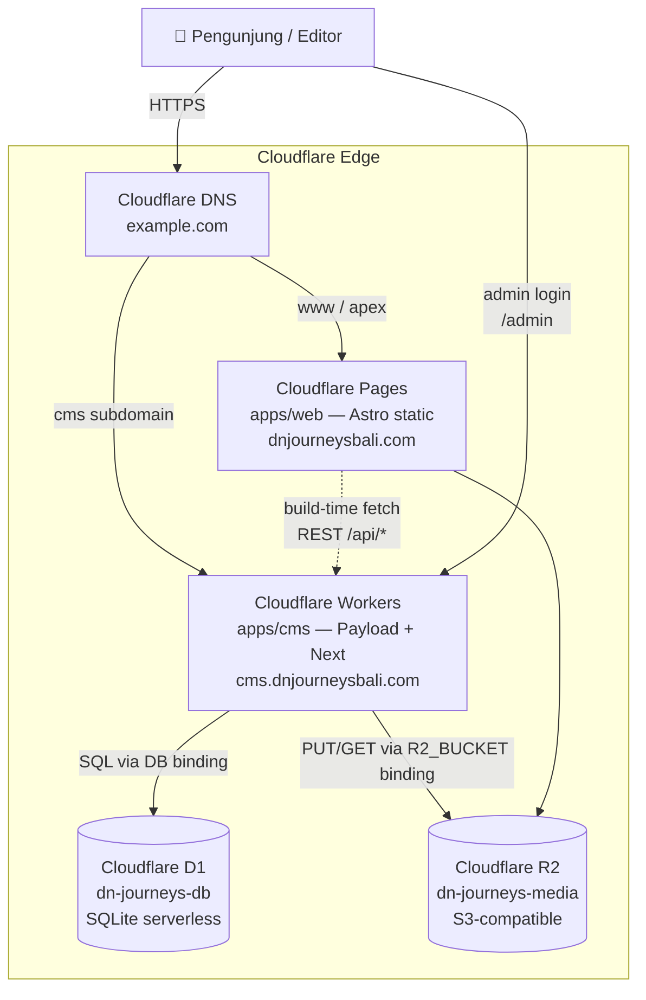

# 05 — INFRA

> Blueprint & SOP infrastruktur proyek **DnJourneysBali** di Cloudflare — Pages (Astro) + Workers (Payload CMS + Next.js via OpenNext) + D1 (database) + R2 (media). Target budget ~$5/bulan.

---

## 1. Arsitektur & Topologi Cloudflare

### 1.1 Diagram topologi



### 1.2 Peran tiap layanan

| Layanan | Fungsi | File konfigurasi |
|---|---|---|
| **Cloudflare Pages** | Serve HTML statis Astro hasil `astro build` (mode `output: 'static'`). Free tier: 500 build/bulan, unlimited requests, CDN global. | [apps/web/astro.config.mjs](apps/web/astro.config.mjs), `apps/web/package.json` script `deploy` |
| **Cloudflare Workers** | Runtime Payload CMS (Next.js 15 di-bundle via OpenNext adapter). Handle admin UI (`/admin`), REST API (`/api/*`), auth, media proxy. Paid tier $5/bulan (10M req + 30s CPU). | [apps/cms/wrangler.toml](apps/cms/wrangler.toml), [apps/cms/next.config.mjs](apps/cms/next.config.mjs) |
| **Cloudflare D1** | Database SQLite serverless. Binding `DB` di Worker → dipakai oleh `@payloadcms/db-sqlite`. Free tier: 5GB storage, 5M reads/hari, 100K writes/hari. | Binding di `wrangler.toml` `[[d1_databases]]` |
| **Cloudflare R2** | Object storage untuk media upload editor. Binding `R2_BUCKET` → dipakai `@payloadcms/storage-r2`. $0.015/GB storage, egress gratis. | Binding di `wrangler.toml` `[[r2_buckets]]` |
| **Cloudflare DNS** | Route custom domain (apex + subdomain CMS) ke Pages/Workers. | Cloudflare Dashboard → DNS |

### 1.3 Estimasi biaya bulanan

| Layanan | Tier | Biaya | Catatan |
|---|---|---|---|
| Pages | Free | $0 | 500 builds/mo cukup — biasa cuma redeploy tiap konten publish. |
| Workers | Paid | **$5** | Wajib paid untuk D1 binding di production. |
| D1 | Included in Paid Workers | $0 | 5GB gratis, cukup untuk template travel agency. |
| R2 | Pay-as-you-go | ~$0.15 | Perkiraan 10GB media × $0.015. Egress **gratis** — signifikan hemat vs S3. |
| DNS | Free (Cloudflare-managed domain) | $0 | Kalau domain di-registrar Cloudflare biaya sekitar $10/tahun terpisah. |
| **TOTAL** | | **~$5.15/bulan** | Fit dengan target $5. |

<!-- TODO: kalau media > 20GB atau traffic > 10M/bulan, review perkiraan ini. -->

---

## 2. Environment Variables & Secrets

### 2.1 `apps/web` — Cloudflare Pages

| Variable | Tipe | Contoh | Deskripsi |
|---|---|---|---|
| `CMS_URL` | Publik (build-time) | `https://cms.dnjourneysbali.com` | Base URL Payload API — dipakai oleh Astro saat build (SSG). Fallback `http://localhost:3030` di dev. Lihat [lib/payload.ts:16](apps/web/src/lib/payload.ts#L16). |

<!-- TODO: file apps/web/.env.example belum ada — buat manual dengan CMS_URL. -->

Set di Cloudflare Dashboard:
- **Pages → project → Settings → Environment variables** → Production & Preview → tambahkan `CMS_URL`.

### 2.2 `apps/cms` — Cloudflare Workers

| Variable | Tipe | Contoh | Deskripsi |
|---|---|---|---|
| `PAYLOAD_SECRET` | **Secret** | random 32+ char | Kunci enkripsi JWT & session. **Wajib** di production. |
| `SERVER_URL` | Publik (vars) | `https://cms.dnjourneysbali.com` | URL publik CMS (dipakai Payload untuk absolute links, email verify). |
| `SITE_URL` | Publik (vars) | `https://dnjourneysbali.com` | Origin frontend — dipakai untuk CORS allowlist. Lihat [payload.config.ts:88-92](apps/cms/src/payload.config.ts#L88). |
| `DATABASE_URI` | (dev only) | `file:./cms.db` | Lokal saja. Di production, akses D1 via **binding** `DB` (bukan connection string) — lihat wrangler.toml. |
| `DB` | Binding | (D1) | Binding D1 database — auto tersedia sebagai `env.DB` di Worker. |
| `R2_BUCKET` | Binding | (R2) | Binding R2 bucket — auto tersedia sebagai `env.R2_BUCKET`. |

<!-- TODO: file apps/cms/.env.example dan .dev.vars belum ada. Buat manual (lihat template §2.4). -->

### 2.3 Publik vs Secret

- **Publik** (`[vars]` di wrangler.toml atau Env Vars di Pages dashboard) — nilai visible di deploy log, aman untuk URL/nama.
- **Secret** — pakai `wrangler secret put <NAME>` untuk Workers, atau Environment Variables → **Encrypt** di Pages dashboard.

### 2.4 Template file env

**apps/web/.env.example** (buat manual):

```bash
CMS_URL=http://localhost:3030
```

**apps/cms/.env.example** (buat manual, untuk dev lokal):

```bash
PAYLOAD_SECRET=change-this-to-a-long-random-string
SERVER_URL=http://localhost:3030
SITE_URL=http://localhost:4321
DATABASE_URI=file:./cms.db
```

**apps/cms/.dev.vars** (buat manual, dipakai `wrangler dev`):

```bash
PAYLOAD_SECRET=dev-secret-32-chars-minimum
SERVER_URL=http://localhost:8787
SITE_URL=http://localhost:4321
```

### 2.5 Set Secrets

**Via Wrangler CLI (recommended):**

```bash
cd apps/cms
wrangler secret put PAYLOAD_SECRET
# Paste value, Enter
```

**Via Dashboard:**
- Workers & Pages → `dn-journeys-cms` → Settings → Variables & Secrets → **Add** → Type: Secret.

---

## 3. Konfigurasi Domain & DNS

Skenario domain contoh: **`dnjourneysbali.com`**.

### 3.1 Custom Domain untuk Pages (frontend)

1. Cloudflare Dashboard → **Workers & Pages** → pilih project `dn-journeys-web`.
2. Tab **Custom domains** → **Set up a custom domain**.
3. Masukkan `dnjourneysbali.com` (apex) → Continue → Activate.
4. Ulangi untuk `www.dnjourneysbali.com`. Cloudflare otomatis buat CNAME/ALIAS record di zone DNS.

### 3.2 Subdomain untuk Workers (CMS/API)

1. Workers & Pages → pilih `dn-journeys-cms` → **Settings** → **Domains & Routes** → **Add**.
2. Pilih **Custom domain**, masukkan `cms.dnjourneysbali.com` → Add.
3. Cloudflare auto-provision SSL cert (~1 menit).

### 3.3 SSL/TLS

- Dashboard → **SSL/TLS** → set mode ke **Full (Strict)** — origin certificate dikelola Cloudflare, tidak ada mixed content.
- **Edge Certificates**: Universal SSL sudah on by default untuk semua domain di zone.
- **HSTS**: opsional, enable setelah semua subdomain HTTPS-ready.

### 3.4 CORS di Payload

CORS allowlist di-set di [payload.config.ts:88-92](apps/cms/src/payload.config.ts#L88):

```ts
cors: [
  'http://localhost:4321',                            // Astro dev
  'http://localhost:3030',                            // CMS admin self
  process.env.SITE_URL ?? 'https://dnjourneysbali.com', // production frontend
],
```

Pastikan `SITE_URL` var di Workers **tepat sama** dengan origin frontend (`https://dnjourneysbali.com`), tanpa trailing slash.

<!-- TODO: kalau ada multi-domain (mis. dnjourneysbali.com + www.dnjourneysbali.com sebagai origin berbeda), tambahkan array explicit di CORS. -->

### 3.5 Ringkasan routing DNS

| Host | Target | Type |
|---|---|---|
| `dnjourneysbali.com` (apex) | Pages `dn-journeys-web` | CNAME (flattened) |
| `www.dnjourneysbali.com` | Pages `dn-journeys-web` | CNAME |
| `cms.dnjourneysbali.com` | Workers `dn-journeys-cms` | Auto (Workers custom domain) |

---

## 4. Konfigurasi File Utama

### 4.1 `apps/cms/wrangler.toml` (existing)

Isi sekarang di [apps/cms/wrangler.toml](apps/cms/wrangler.toml):

```toml
name = "dn-journeys-cms"
compatibility_date = "2025-09-30"
compatibility_flags = ["nodejs_compat"]

main = ".open-next/worker.js"

[vars]
PAYLOAD_SECRET = "CHANGE-THIS-TO-A-RANDOM-32-CHAR-STRING"   # ← ganti ke wrangler secret put
SERVER_URL = "http://localhost:8787"

[[d1_databases]]
binding = "DB"
database_name = "dn-journeys-db"
database_id = "YOUR_D1_DATABASE_ID"   # ← isi setelah wrangler d1 create

[[r2_buckets]]
binding = "R2_BUCKET"
bucket_name = "dn-journeys-media"
```

**⚠️ Yang perlu diubah sebelum production:**

1. Pindahkan `PAYLOAD_SECRET` dari `[vars]` (plaintext) ke **secret**:
   ```bash
   wrangler secret put PAYLOAD_SECRET
   ```
   Hapus baris `PAYLOAD_SECRET` dari `[vars]`.
2. Set `SERVER_URL` ke domain production (`https://cms.dnjourneysbali.com`).
3. Tambahkan `SITE_URL`:
   ```toml
   [vars]
   SERVER_URL = "https://cms.dnjourneysbali.com"
   SITE_URL = "https://dnjourneysbali.com"
   ```
4. Isi `database_id` dgn output `wrangler d1 create dn-journeys-db`.
5. (Opsional) Environment terpisah untuk staging:
   ```toml
   [env.staging]
   name = "dn-journeys-cms-staging"
   [[env.staging.d1_databases]]
   binding = "DB"
   database_name = "dn-journeys-db-staging"
   database_id = "..."
   [[env.staging.r2_buckets]]
   binding = "R2_BUCKET"
   bucket_name = "dn-journeys-media-staging"
   ```

### 4.2 `apps/web/astro.config.mjs` (existing)

```js
import { defineConfig } from 'astro/config'
import tailwind from '@astrojs/tailwind'
import sitemap from '@astrojs/sitemap'

export default defineConfig({
  site: 'https://dnjourneysbali.com',
  output: 'static',
  integrations: [tailwind(), sitemap({ filter: (p) => !p.includes('/admin') })],
  image: { domains: ['dn-journeys-media.r2.cloudflarestorage.com'] },
})
```

Karena `output: 'static'`, **tidak butuh** Cloudflare adapter runtime (`@astrojs/cloudflare`) untuk build produksi. Dependensi `@astrojs/cloudflare` di [apps/web/package.json:16](apps/web/package.json#L16) sekarang **tidak dipakai** — bisa dihapus kalau tetap static. Kalau nanti ada rute SSR (`output: 'hybrid'`), aktifkan adapter:

```js
import cloudflare from '@astrojs/cloudflare'
export default defineConfig({
  output: 'hybrid',
  adapter: cloudflare(),
  // ...
})
```

### 4.3 Payload config → D1 + R2

**D1 adapter** — [payload.config.ts:97-101](apps/cms/src/payload.config.ts#L97):

```ts
db: sqliteAdapter({
  client: {
    url: process.env.DATABASE_URI || `file:${path.resolve(dirname, '../cms.db')}`,
  },
}),
```

<!-- TODO: config di atas pakai libSQL URL, cocok untuk lokal. Untuk produksi Cloudflare Workers dgn D1 binding, ganti driver ke `d1HttpAdapter` atau pakai wrapper `@payloadcms/db-sqlite` versi D1 binding. Contoh: -->

```ts
// Production D1 binding pattern
import { sqliteD1Adapter } from '@payloadcms/db-sqlite'
db: sqliteD1Adapter({ binding: env.DB })
```

**R2 storage** — belum di-wire di `payload.config.ts` walau package `@payloadcms/storage-r2` sudah di-install. Tambahkan:

```ts
import { r2Storage } from '@payloadcms/storage-r2'

export default buildConfig({
  // ... existing config
  plugins: [
    r2Storage({
      collections: {
        media: true,
      },
      bucket: env.R2_BUCKET,       // R2 binding
      config: {
        // opsional custom URL prefix untuk publik URL
      },
    }),
  ],
})
```

<!-- TODO: `plugins: [r2Storage(...)]` belum dipasang di apps/cms/src/payload.config.ts — perlu ditambah sebelum deploy production, kalau tidak upload media akan gagal di Worker. -->

---

## 5. Cheat Sheet Perintah CLI

### 5.1 Setup awal (sekali per project/client)

```bash
# Install & login wrangler
pnpm add -g wrangler
wrangler login

# Buat D1 database
wrangler d1 create dn-journeys-db
# → Copy database_id ke apps/cms/wrangler.toml [[d1_databases]] database_id

# Buat R2 bucket
wrangler r2 bucket create dn-journeys-media

# Set secrets (dari dalam apps/cms/)
cd apps/cms
wrangler secret put PAYLOAD_SECRET
```

### 5.2 Local development

```bash
# Terminal 1 — CMS (Payload via Next.js, port 3030)
pnpm dev:cms

# Terminal 2 — Astro frontend (port 4321)
pnpm dev:web
```

CMS lokal pakai SQLite file `apps/cms/cms.db`, bukan D1. Untuk emulasi D1/R2 lokal via Miniflare:

```bash
cd apps/cms
wrangler dev
# Otomatis emulate D1 + R2 binding
```

### 5.3 Database migration (D1)

Payload SQLite adapter (Drizzle) — perintah migrasi ada di CLI Payload:

```bash
cd apps/cms

# Generate migration file baru dari perubahan schema
pnpm payload migrate:create

# Jalankan migrasi ke DB lokal (cms.db)
pnpm payload migrate

# Jalankan migrasi ke D1 production
wrangler d1 migrations apply dn-journeys-db --remote
```

<!-- TODO: folder migrations/ belum ada — akan auto-generated saat migrate:create pertama kali dijalankan. -->

Regenerate TypeScript types setiap ubah schema:

```bash
pnpm generate:types
```

### 5.4 Build & Deploy

**Frontend (Pages):**

```bash
# Dari root
pnpm build:web           # astro build → apps/web/dist/
pnpm deploy:web          # astro build + wrangler pages deploy dist/

# Atau manual explicit
cd apps/web
wrangler pages deploy dist/ --project-name=dn-journeys-web
```

**Backend (Workers via OpenNext):**

```bash
pnpm build:cms           # next build
pnpm deploy:cms          # next build + opennextjs-cloudflare build + wrangler deploy
```

Deploy keduanya sekaligus:

```bash
pnpm deploy:cms && pnpm deploy:web
```

<!-- TODO: tidak ada script `deploy:all` di root — tambahkan kalau sering deploy bersamaan. -->

### 5.5 CI/CD (opsional)

Pages otomatis rebuild kalau di-connect ke GitHub repo (Cloudflare Dashboard → Pages → Connect Git). Trigger rebuild backend + frontend saat push ke `main` dengan GitHub Actions:

```yaml
# .github/workflows/deploy.yml (contoh — belum dibuat)
name: Deploy
on:
  push:
    branches: [main]
jobs:
  deploy:
    runs-on: ubuntu-latest
    steps:
      - uses: actions/checkout@v4
      - uses: pnpm/action-setup@v3
      - run: pnpm install
      - run: pnpm deploy:cms
        env: { CLOUDFLARE_API_TOKEN: ${{ secrets.CF_API_TOKEN }} }
      - run: pnpm deploy:web
        env: { CLOUDFLARE_API_TOKEN: ${{ secrets.CF_API_TOKEN }} }
```

---

## 6. Maintenance, Backup & Troubleshooting

### 6.1 Backup D1

```bash
# Export full database ke SQL
wrangler d1 export dn-journeys-db --remote --output=backup-$(date +%Y%m%d).sql

# Restore ke DB baru (mis. staging)
wrangler d1 execute dn-journeys-db-staging --file=backup-YYYYMMDD.sql --remote
```

Jadwal backup: **mingguan** untuk site aktif, harian kalau editorial tinggi. Simpan di R2 bucket terpisah atau external storage.

### 6.2 Backup R2

```bash
# Sync bucket ke lokal via wrangler
for key in $(wrangler r2 object list dn-journeys-media --output=json | jq -r '.[].key'); do
  wrangler r2 object get dn-journeys-media/$key --file=./r2-backup/$key
done

# Atau pakai rclone (lebih cepat, mendukung parallel + delta)
rclone sync r2:dn-journeys-media ./r2-backup --transfers=8
```

Setup `rclone` config: [rclone.org/s3/#cloudflare-r2](https://rclone.org/s3/#cloudflare-r2).

### 6.3 Monitoring Logs

```bash
# Real-time log Worker (streaming)
wrangler tail dn-journeys-cms

# Filter status/method
wrangler tail dn-journeys-cms --status error --method POST

# Log Pages build via Dashboard
# → Pages → project → Deployments → klik deploy → View build log
```

Metrics: Cloudflare Dashboard → Workers → analytics → CPU time / requests / errors.

### 6.4 Troubleshooting umum

| Gejala | Cek |
|---|---|
| **Worker 500 / crash** | `wrangler tail` — cari stack trace. Common cause: `PAYLOAD_SECRET` belum di-set, atau D1 binding salah nama. |
| **D1 migration gagal** | `wrangler d1 execute dn-journeys-db --command "SELECT name FROM sqlite_master WHERE type='table'" --remote` — verifikasi state DB. Kalau field type mismatch (mis. text vs number), rollback: restore dari backup terakhir. |
| **R2 upload gagal (media 500)** | 1) Verifikasi `r2Storage` plugin sudah di-register di `payload.config.ts` (lihat §4.3 TODO). 2) Cek binding: `wrangler r2 object list dn-journeys-media --remote`. 3) Cek Worker log. |
| **Pages build gagal** | Dashboard → Deployments → build log. Common: env var `CMS_URL` tidak ter-set, atau CMS lagi down saat build (SSG fetch fail). |
| **CORS error di browser** | `SITE_URL` var di Worker beda dgn origin actual. Update `wrangler.toml [vars]` + redeploy. |
| **`Failed to fetch` di Astro** | `CMS_URL` env di Pages salah, atau CMS Worker down. Cek `curl https://cms.dnjourneysbali.com/api/tours`. |
| **Draft entry muncul di production** | Cek query di `apps/web/src/lib/payload.ts` — default `where[status][equals]=published`. Kalau custom, pastikan filter tetap ada. |

### 6.5 Rollback Deploy

```bash
# List deploy history
wrangler deployments list

# Rollback ke versi sebelumnya
wrangler rollback [deployment-id]

# Pages rollback via Dashboard: Deployments → titik-tiga di deploy lama → "Rollback to this deployment"
```

---

## 7. Checklist Deploy Client Baru (Template Reuse)

Estimasi total waktu setup client baru: **~1 jam** (dari clone repo → live di custom domain).

### Prep (10 menit)

- [ ] Clone repo: `git clone <repo> client-name && cd client-name`
- [ ] Install deps: `pnpm install`
- [ ] Update `name` di root `package.json` + `apps/*/package.json`
- [ ] Update branding hardcoded di [apps/web/src/config/site.ts](apps/web/src/config/site.ts) (fallback saja — nanti di-override CMS)
- [ ] Update `apps/web/astro.config.mjs` → `site: 'https://client-domain.com'`

### Provisioning Cloudflare (15 menit)

- [ ] Login: `wrangler login`
- [ ] Buat D1: `wrangler d1 create client-db` → copy `database_id`
- [ ] Buat R2: `wrangler r2 bucket create client-media`
- [ ] Update `apps/cms/wrangler.toml`:
  - [ ] `name = "client-cms"`
  - [ ] `database_name = "client-db"`, `database_id = "..."`
  - [ ] `bucket_name = "client-media"`
- [ ] Set secret: `cd apps/cms && wrangler secret put PAYLOAD_SECRET`
- [ ] Update `[vars] SERVER_URL` + `SITE_URL` di `wrangler.toml`

### Deploy pertama (10 menit)

- [ ] `pnpm generate:types`
- [ ] `pnpm deploy:cms` → dapat URL `client-cms.<subdomain>.workers.dev`
- [ ] Test admin: buka URL/admin → buat super-admin pertama
- [ ] Set env `CMS_URL` di Pages dashboard (nilai = Worker URL atau custom domain)
- [ ] `pnpm deploy:web`

### Custom Domain (10 menit)

- [ ] Add domain ke Cloudflare zone (kalau belum)
- [ ] Pages → Custom domains → `clientdomain.com` + `www.clientdomain.com`
- [ ] Workers → Custom domains → `cms.clientdomain.com`
- [ ] Update `SERVER_URL` & `SITE_URL` di `wrangler.toml` → redeploy CMS
- [ ] Update `CMS_URL` di Pages env → trigger rebuild

### Seed data awal (15 menit)

- [ ] Login admin CMS → Users → tambah admin & editor untuk klien
- [ ] Isi `site-settings` — logo, nama, kontak, WhatsApp number, social
- [ ] Isi `header-settings` — pilih menu utama
- [ ] Isi `footer-settings` — kolom
- [ ] Buat `menus` — main-navigation, footer menu (Quick Links, Company, dst.)
- [ ] Buat Destinations awal (Bali, Nusa Penida, Lombok, dst.)
- [ ] Buat Categories per modul
- [ ] Toggle module di [apps/web/src/config/modules.ts](apps/web/src/config/modules.ts) sesuai layanan yang aktif client
- [ ] (Opsional) Buat halaman `slug=home` dgn blocks untuk custom homepage
- [ ] Redeploy web: `pnpm deploy:web`

### Verifikasi

- [ ] Buka `https://clientdomain.com` — homepage tampil
- [ ] Buka `/tours` (atau modul aktif) — listing muncul (walau kosong)
- [ ] Login `/admin` di `cms.clientdomain.com` — bisa masuk & CRUD
- [ ] Upload gambar via Media → cek URL R2 tampil
- [ ] Test WhatsApp CTA — nomor benar
- [ ] Backup pertama: `wrangler d1 export client-db --remote --output=initial.sql`

---

## Referensi silang

- Arsitektur monorepo & alur data → [01-ARCHITECTURE.md](docs/01-ARCHITECTURE.md)
- Skema database → [02-DATABASE-SCHEMA.md](docs/02-DATABASE-SCHEMA.md)
- Content model & audit no-hardcode → [03-CONTENT-MODEL.md](docs/03-CONTENT-MODEL.md)
- RBAC → [04-RBAC.md](docs/04-RBAC.md)
- Runbook operasional harian → **06-MAINTENANCE-RUNBOOK.md**
